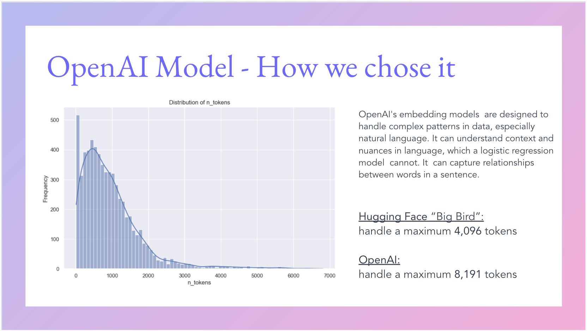
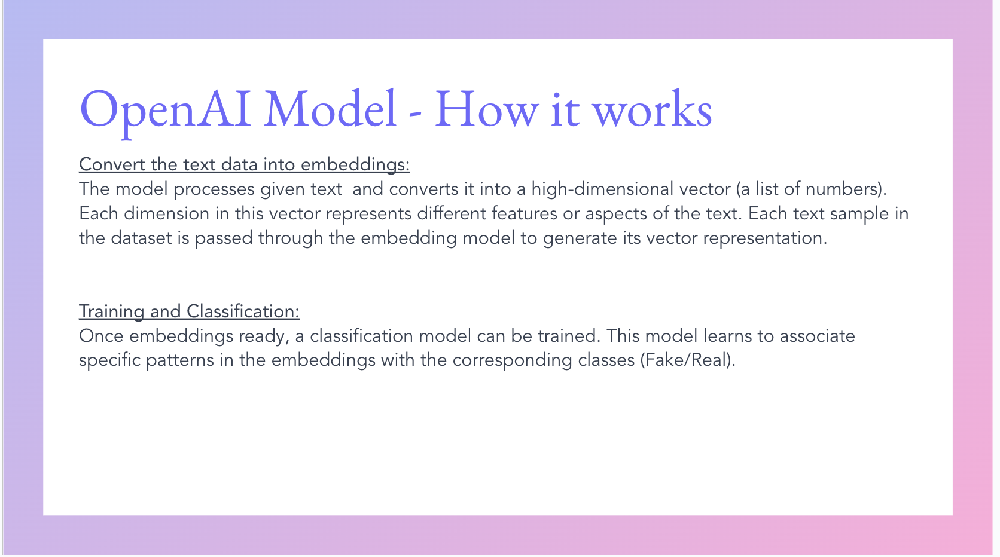
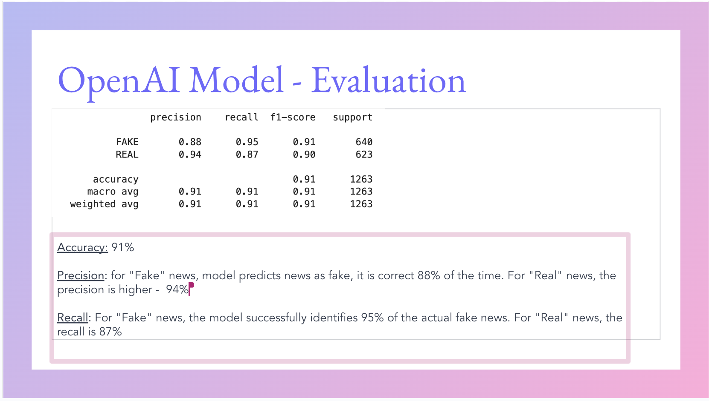

# fake_or_real_news

## Overview
- The idea behind “Fake or Real News Predictor” project was to apply Machine Learning techniques to predict whether a particular news story is real or fake.
- We wanted to test if leveraging various ML techniques and applications could provide a good assessment of the veracity of an article or a news report
- We also wanted to understand how and which ML model we can train to accomplish the task above in the best possible way
- Our main hypothesis was that using a Generative Pre-Trained Transformer (neuro networks) would yield better accuracy than a logistic model (baseline machine learning).

## Model Summary
- The input data was pulled from Kaggle.  It contained 6200+ records.  Each record contained 3 elements: the title of the article, the text of the article, and a classifier (real/false)
- The data was used to train and test models using:
	- Simple models that parsed the title and text of the articles into individual words and used Random Forrest and Logistic Regression to classify each article.  The results were checked against the actual classifiers
	- OpenAI Pre Trained (neuro network) model using embeddings translates text into a numerical format (embeddings) that represents the meaning of words and their relationships. It then analyzes these numerical representations to categorize the text into specific classes or categories based on its content.

## Data Clean-Up 
- Reading the article data
- Removing rows with NAs
- Removing duplicate words
- Removing special characters while keeping apostrophes to preserve the meaning
- Columns updated from Object data types to string
- Making text not case-sensitive 
- Standardizing the classification types

## Model Training
- Creating training and testing datasets with the following breakdown (2/3 training data vs. 1/3 Testing data) for ML models
- Creating training and testing datasets with the following breakdown (20% training data vs. 80% Testing data) for OpenAI  models

 

 

 

 

 

## Conclusion
- OpenAI Based model showed a significantly higher accuracy rate of 91% vs 75% (for best performing simple model), which supported our initial hypothesis
	- OpenAI model used only 20% of the data available to train, yet still delivered superior results

- The high accuracy classification rate of the OpenAI model proves the viability of using this ML-based model to determine the validity of news articles in a very time-efficient way
- This could make a powerful research tool that allows quick discard of invalid/fake news from a particular analysis on various economic, financial, scientific, and political topics

## Next Steps
- We’ve discussed the possibility of doing additional testing of articles and user inputs  that were not part of our original dataset
- We’ve also considered leveraging OpenAI Model to do different types of assessment/classification of news articles to identify hate speech, and political leanings, or to determine the overall subject of the publication (economy, politics, travel, science, etc.)

- The high accuracy classification rate of the OpenAI model proves viability of using this ML based model to determine the validity of news articles in a very time efficient way
- This could make a powerful research tool which allows quickly discard invalid/fake news from a particular analysis on various economic, financial, scientific and political topics

## Next Steps
- We’ve discussed possibility of doing additional testing of articles and user inputs  that were not part of our original data set
- We’ve also considered leveraging OpenAI Model to do different type of assessment/classification of news articles to identify hate speech, political leanings, or to determine overall subject of the publication (economy, politics, travel, science, etc.)

- Determining which words were more likely associated with fake or real classifications
